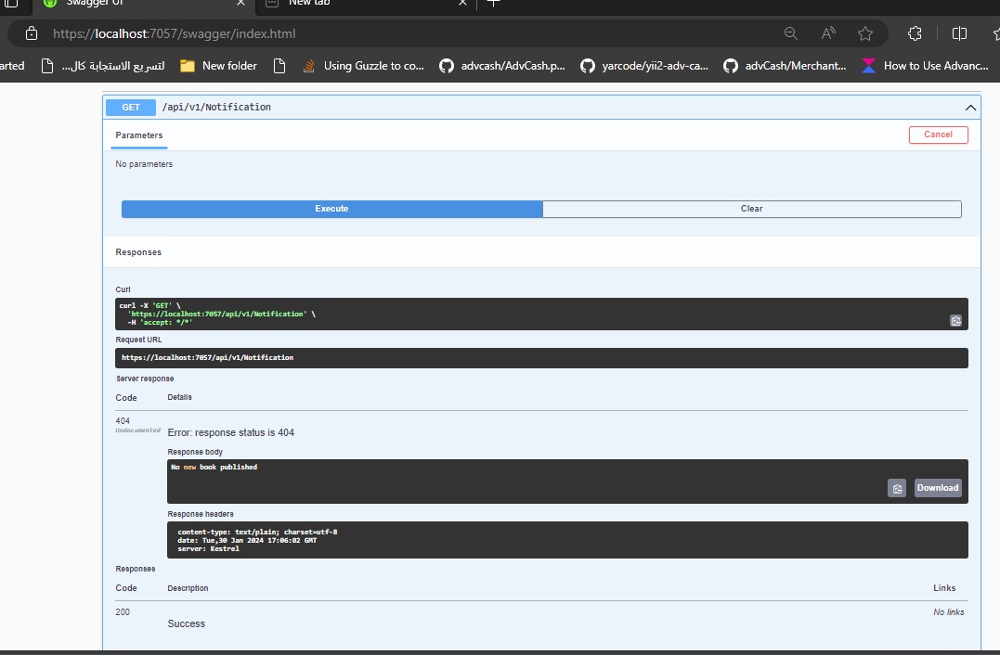
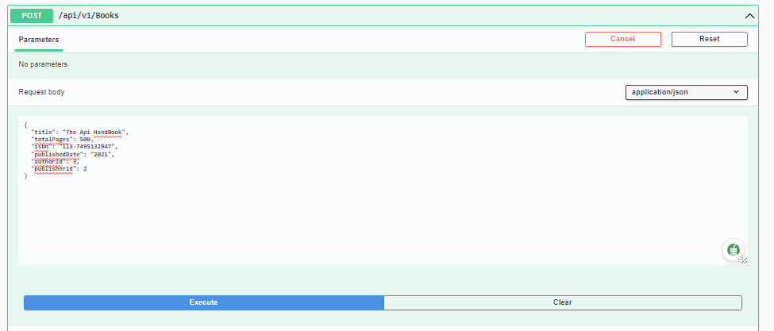
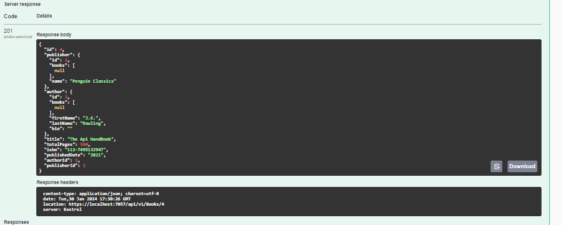
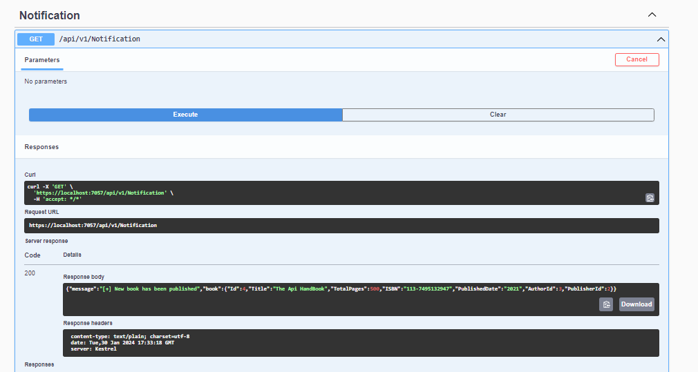
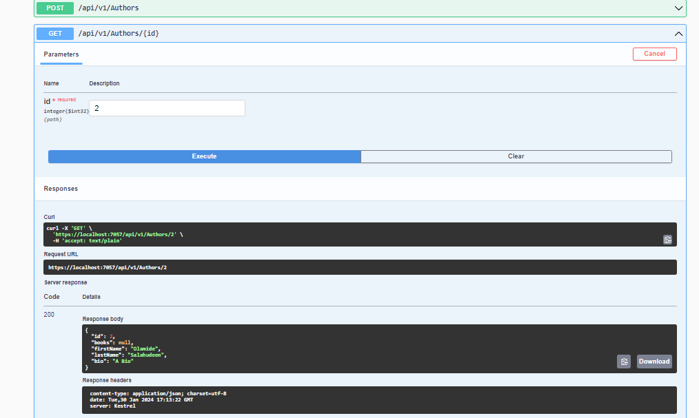
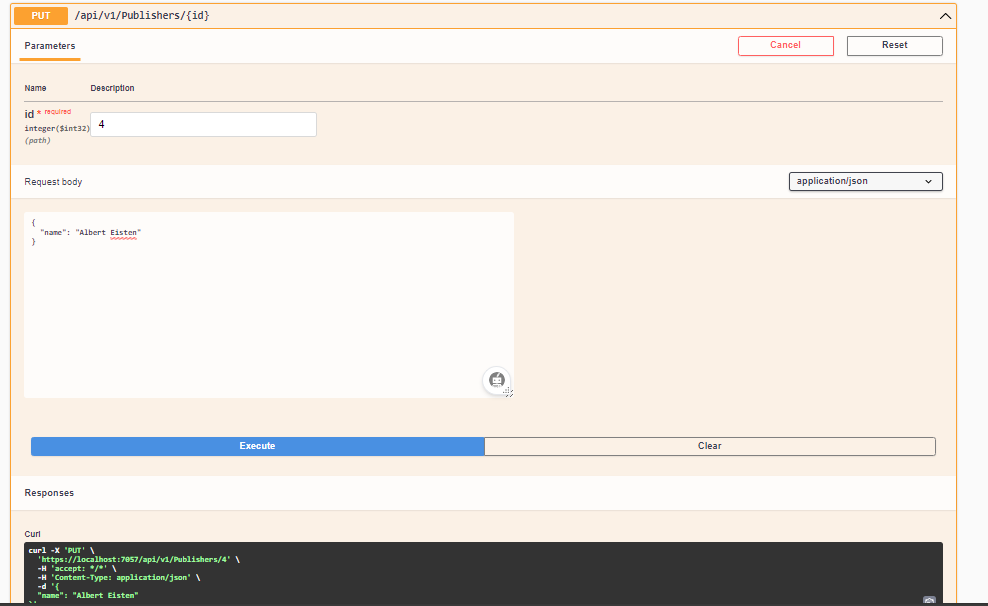
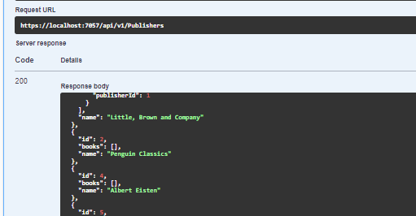
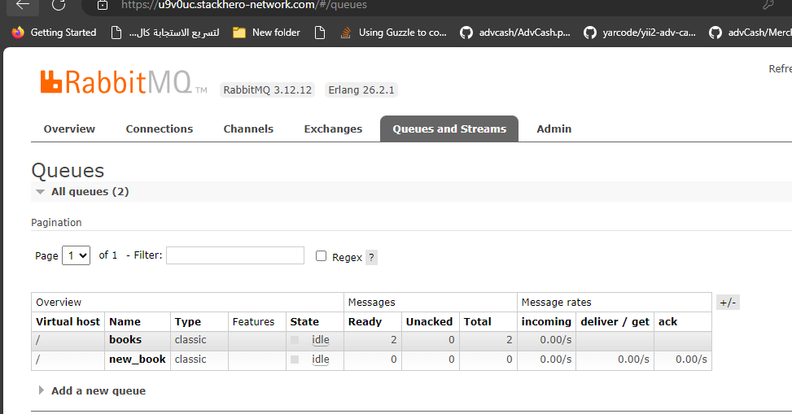

# Simple Library CRUD API Documentation

Welcome to the Simple Library CRUD API documentation application. This API allows restful operations on Books, Authors & Publisher Information.

## Table of Contents

- [Getting Started](#getting-started)
  - [Prerequisites](#prerequisites)
  - [Installation](#installation)
- [API Endpoints](#api-endpoints)
- [Request and Response Formats](#request-and-response-formats)
- [Sample Usage](#sample-usage)
- [License](#license)

## Getting Started

### Prerequisites

Before you start, make sure you have the following prerequisites installed on your system:

- Dotnet Sdk (>= 8.0)
- RabbitMQ
- Redis
- Database (e.g., MSSQL) or Cloud MSSQL. In this project, Cloud SQL Server database was used

### Installation

1. Clone this repository:
    Open a terminal and run 
    
   ```bash
   git clone https://github.com/7j4n1/BookApi.git
   cd BookApi 
   ```

2. Install the dotnet packages for the project in the project by running:

    ```bash
    dotnet build
    ```
3. Configure your application settings in the appsettings.json:
    ```bash
    cp appsettings.Development.json appsettings.json
    ```
    Configure the database, redis and rabbitmq config variables as follows:
    ```bash
    "AllowedHosts": "*",
    "RedisCloudUrl": "redis-hostname:port,password=your-password",
    "RabbitMqUrl": "your-rabbitmqsetting-endpoint-goes-here",
    "ConnectionStrings": {
        "DefaultConnection" : "Data Source=mssql-servername;Initial Catalog=database-name;User ID=username;Password=password;TrustServerCertificate=true;"
    }
    ```
4. Ensure that you've started them 3 servers (Redis, SQL Server, RabbitMQ)
5. Run the migrations:
    ```bash
    dotnet build

    dotnet-ef migrations add "Migration Name"

    dotnet-ef database update  - to update the database with the Api Models
    ```
6. Start the development server:
    ```bash
    dotnet run | dotnet run --launch-profile https (To force run on https scheme)

    ```
    BookApi API is now up and running on {https://localhost:7057} which is the base url!

7. Open a browser and navigate to https://localhost:7057/swagger to see an API documentation

### API Endpoints

### Request and Response Formats
The API uses JSON for both requests and responses. The following table describes the JSON format for the requests and responses:

### Books
<table>
    <thead>
        <th> Requests </th>
        <th> Response </th>
    </thead>
    <tbody>
        <tr>
            <td>POST /api/v1/Books</td>
            <td>201 Created with the newly created book in the response body</td>
        </tr>
        <tr>
            <td>GET /api/v1/Books</td>
            <td>200 OK with an array of Books in the response body.</td>
        </tr>
        <tr>
            <td>GET /api/v1/Books/{id}</td>
            <td>200 OK with the book with the specified id in the response body.</td>
        </tr>
        <tr>
            <td>PUT /api/v1/Books/{id}</td>
            <td>200 OK with the updated book in the response body.</td>
        </tr>
        <tr>
            <td>DELETE /api/v1/Books/{id}</td>
            <td>204 No Content</td>
        </tr>
    </tbody>
</table>
### Author
<table>
    <thead>
        <th> Requests </th>
        <th> Response </th>
    </thead>
    <tbody>
        <tr>
            <td>POST /api/v1/Authors</td>
            <td>201 Created with the newly created author in the response body</td>
        </tr>
        <tr>
            <td>GET /api/v1/Authors</td>
            <td>200 OK with an array of Authors in the response body.</td>
        </tr>
        <tr>
            <td>GET /api/v1/Authors/{id}</td>
            <td>200 OK with the author with the specified id in the response body.</td>
        </tr>
        <tr>
            <td>PUT /api/v1/Authors/{id}</td>
            <td>200 OK with the updated author in the response body.</td>
        </tr>
        <tr>
            <td>DELETE /api/v1/Authors/{id}</td>
            <td>204 No Content</td>
        </tr>
    </tbody>
</table>
### Publisher
<table>
    <thead>
        <th> Requests </th>
        <th> Response </th>
    </thead>
    <tbody>
        <tr>
            <td>POST /api/v1/Publishers</td>
            <td>201 Created with the newly created publisher in the response body</td>
        </tr>
        <tr>
            <td>GET /api/v1/Publishers</td>
            <td>200 OK with an array of Publishers in the response body.</td>
        </tr>
        <tr>
            <td>GET /api/v1/Publishers/{id}</td>
            <td>200 OK with the publisher with the specified id in the response body.</td>
        </tr>
        <tr>
            <td>PUT /api/v1/Publishers/{id}</td>
            <td>204 OK with no content</td>
        </tr>
        <tr>
            <td>DELETE /api/v1/Publishers/{id}</td>
            <td>204 No Content</td>
        </tr>
    </tbody>
</table>

### Notification

<table>
    <thead>
        <th> Requests </th>
        <th> Response </th>
    </thead>
    <tbody>
        <tr>
            <td>GET /api/v1/Notification</td>
            <td>200 OK with a single notification fetched from the Queue Consumer in the response body.</td>
        </tr>
    </tbody>
</table>

### Note

Once a new Book is uploaded from the /Books enpoint, The RabbitMQ Producer publish the new book info and a message "New book has been published" to the Queue
and the Notification enpoint uses an async Class Method to get consume the message from the queue through the route "new_book".

And if no new Book published, the Nofitication return "No new book published"

### Sample Usage

## No Nofication available



## Adding a new Book (201 Created)




## The details of the new Book posted


## Fetch the details of a author (200 OK)



## Modify the details of an existing publisher (204)




## RabbitMQ Management Dashboard



### License

The MIT License (MIT)